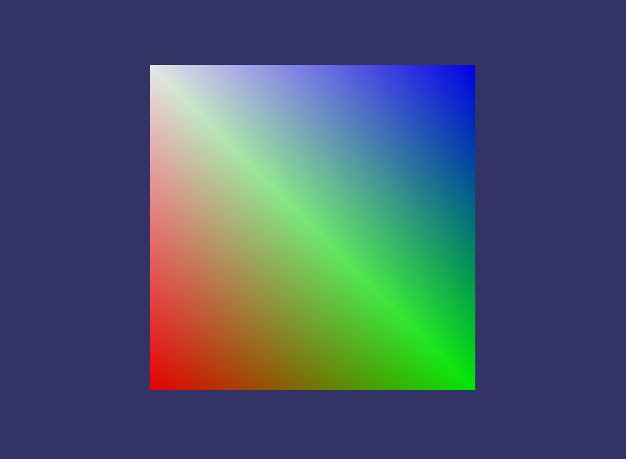

* OSG 坐标轴：X 轴向右，Y 轴向里，Z 轴向上
* 运行此代码，会在 VS 的项目目录下生成一个 Simple.osg 文件

```cpp
#include <osg/Geode>
#include <osg/Geometry>

osg::ref_ptr<osg::Node> createSceneGraph() {
  // 创建一个用于保存几何信息的对象
  osg::ref_ptr<osg::Geometry> geom = new osg::Geometry;

  // 创建四个顶点的数组
  osg::ref_ptr<osg::Vec3Array> v = new osg::Vec3Array;
  geom->setVertexArray(v.get());
  v->push_back(osg::Vec3(-1.f, 0.f, -1.f));
  v->push_back(osg::Vec3(1.f, 0.f, -1.f));
  v->push_back(osg::Vec3(1.f, 0.f, 1.f));
  v->push_back(osg::Vec3(-1.f, 0.f, 1.f));

  // 创建四种颜色的数组
  osg::ref_ptr<osg::Vec4Array> c = new osg::Vec4Array;
  geom->setColorArray(c.get());
  geom->setColorBinding(osg::Geometry::BIND_PER_VERTEX);
  c->push_back(osg::Vec4(1.f, 0.f, 0.f, 1.f));
  c->push_back(osg::Vec4(0.f, 1.f, 0.f, 1.f));
  c->push_back(osg::Vec4(0.f, 0.f, 1.f, 1.f));
  c->push_back(osg::Vec4(1.f, 1.f, 1.f, 1.f));

  // 为唯一的法线创建一个数组
  osg::ref_ptr<osg::Vec3Array> n = new osg::Vec3Array;
  geom->setNormalArray(n.get());
  geom->setNormalBinding(osg::Geometry::BIND_OVERALL);
  n->push_back(osg::Vec3(0.f, -1.f, 0.f));

  // 由保存的数据绘制四个顶点的多边形
  geom->addPrimitiveSet(new osg::DrawArrays(osg::PrimitiveSet::QUADS, 0, 4));

  // 向 Geode 类添加几何体（Drawable）并返回 Geode
  osg::ref_ptr<osg::Geode> geode = new osg::Geode;
  geode->addDrawable(geom.get());
  return geode.get();
}

// 编写 main 函数入口，调用上面的 createSceneGraph 创建场景图形
// 并将其写入到 Simple.osg 文件中
#include <iostream>
#include <osg/Notify>
#include <osg/ref_ptr>
#include <osgDB/Registry>
#include <osgDB/WriteFile>

int main(int, char**) {
  osg::ref_ptr<osg::Node> root = createSceneGraph();
  if (!root.valid()) {
    osg::notify(osg::FATAL) << "Failed in createSceneGraph()." << std::endl;
  }

  bool result = osgDB::writeNodeFile(*(root.get()), "Simple.osg");
  if (!result) {
    osg::notify(osg::FATAL) << "Failed in osgDB::writeNode()." << std::endl;
  }
}
```

* osgviewer 快捷键

```sh
# 帮助
h
# 全屏、窗口
f
# 多边形模式、线框模式、点模式
w
# 贴图映射
t
# 光照
l
# 背面拣除
b
# 统计信息
s
# 开始记录
z
# 回放、停止回放
z+shift
```

* 使用 osgviewer 查看效果


