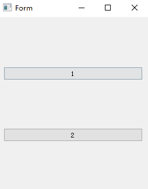

* [QWidget Events](http://doc.qt.io/qt-5/qwidget.html#events)
* [enum QEvent::Type](http://doc.qt.io/qt-5/qevent.html)

* 要在鼠标悬停不点击时 mouseMoveEvent，要同时对主窗口和覆盖在其上中心窗口控件 setMouseTracking

```cpp
dlg::dlg(QWidget* parent) : QMainWindow(parent), ui(new Ui::Form) {
  ui->setupUi(this);
  setMouseTracking(true);
  mainLayout = new QVBoxLayout;

  mainWidget = new QWidget;
  mainWidget->setMouseTracking(true);
  mainWidget->setLayout(mainLayout);
  setCentralWidget(mainWidget);
}
```

* 重写事件时，QMouseEvent 在 VS 中不会自动补全，对应的能补全的头文件是 qevent.h

```cpp
// 下面两者等价
#include <QMouseEvent>

#include "qevent.h"
```
* 设置鼠标形状
```cpp
setCursor(Qt::ArrowCursor);    // 默认形状
setCursor(Qt::SizeHorCursor);  // 水平双向箭头
setCursor(Qt::SizeVerCursor);  // 垂直双向箭头
```

## 重写 resizeEvent

* 目标：改变窗口大小时，窗口中的控件布局将相应改变。如：窗口中包含两个 QPushButton 控件，宽度小于 400 时，两个按钮垂直排列，宽度拉伸不低于 400 时，两个按钮则变为垂直排列
* 方法：重载 resizeEvent 即可
* Widget.h

```cpp
#ifndef WIDGET_H
#define WIDGET_H

#include <QMainWindow>

#include "qboxlayout.h"
#include "qpushbutton.h"

namespace Ui {
class Form;
}

class widget : public QMainWindow {
  Q_OBJECT

 public:
  explicit widget(QWidget* parent = 0);
  ~widget();

 private:
  Ui::Form* ui;

  QPushButton* btn1;
  QPushButton* btn2;
  QWidget* centralWidget;

 protected:
  void resizeEvent(QResizeEvent* event);
};

#endif  // WIDGET_H
```

* Widget.cpp

```cpp
#include "Widget.h"
#include "ui_Widget.h"

widget::widget(QWidget* parent) : QMainWindow(parent), ui(new Ui::Form) {
  ui->setupUi(this);

  btn1 = new QPushButton;
  btn1->setText("1");
  btn2 = new QPushButton;
  btn2->setText("2");
  centralWidget = new QWidget;
  setCentralWidget(centralWidget);
}

widget::~widget() { delete ui; }

void widget::resizeEvent(QResizeEvent* event) {
  int w = width();
  if (w < 400) {
    if (centralWidget->layout()) {
      delete centralWidget->layout();
    }
    QVBoxLayout* layout = new QVBoxLayout;
    layout->addWidget(btn1);
    layout->addWidget(btn2);
    centralWidget->setLayout(layout);
  } else {
    if (centralWidget->layout()) {
      delete centralWidget->layout();
    }
    QHBoxLayout* layout = new QHBoxLayout;
    layout->addWidget(btn1);
    layout->addWidget(btn2);
    centralWidget->setLayout(layout);
  }
}
```

## 实现效果


## 存在问题

* 当窗口尺寸不低于 400，点击最大化和还原不会改变布局（正常预期）


* 但当窗口尺寸低于 400，按钮纵向排列，点击最大化之后按钮仍纵向排列（预期是窗口不低于 400 宽度则横向排列）


* 再次点击还原，布局却又变为横向排列（预期是窗口低于 400 宽度则纵向排列）


* 不断点击最大化和还原则将重复上述两种情况，直到拖动窗口大小时又会变为正常情况

## 改进

* 通过 qDebug 测试，最大化和还原都正确触发了事件

```cpp
void widget::resizeEvent(QResizeEvent* event) {
  int w = width();
  if (w < 400) {
    if (centralWidget->layout()) {
      delete centralWidget->layout();
      qDebug() << "d1";
    }
    QVBoxLayout* layout = new QVBoxLayout;
    layout->addWidget(btn1);
    layout->addWidget(btn2);
    centralWidget->setLayout(layout);
    qDebug() << "aaa";
  } else {
    if (centralWidget->layout()) {
      delete centralWidget->layout();
      qDebug() << "d2";
    }
    QHBoxLayout* layout = new QHBoxLayout;
    layout->addWidget(btn1);
    layout->addWidget(btn2);
    centralWidget->setLayout(layout);
    qDebug() << "bbb";
  }
}
```

* 找不出原因，绕过此问题，不选择 delete 布局，而是直接 new 新的 QWidget

```cpp
// Widget.cpp
#include "Widget.h"
#include "ui_Widget.h"

widget::widget(QWidget* parent) : QMainWindow(parent), ui(new Ui::Form) {
  ui->setupUi(this);

  btn1 = new QPushButton;
  btn1->setText("1");
  btn2 = new QPushButton;
  btn2->setText("2");
}

widget::~widget() { delete ui; }

void widget::resizeEvent(QResizeEvent* event) {
  int w = width();
  centralWidget = new QWidget;
  if (w < 400) {
    QVBoxLayout* layout = new QVBoxLayout;
    layout->addWidget(btn1);
    layout->addWidget(btn2);
    centralWidget->setLayout(layout);
  } else {
    QHBoxLayout* layout = new QHBoxLayout;
    layout->addWidget(btn1);
    layout->addWidget(btn2);
    centralWidget->setLayout(layout);
  }
  setCentralWidget(centralWidget);
}
```

* 现在最大化和还原将达到预期效果




## 加入滚动条

* 目标：当控件超出窗口大小时，需要提供滚动条，否则控件将缩小并排满窗口。如：窗口中包含 10 张表格，每张表格高度至少为 300，当窗口宽度小于 800 时，表格垂直排列，不低于 800 时则水平排列
* 方法：使用 QScrollArea 设置一片带滚动条的区域，这个区域是空的，还需要用 setWidget 添加一个控件，setWidget 只能添加一个控件，如果多次使用只保留最后的设置，若之前 setWidget 的控件未释放则将成为悬挂指针。在处理上面举例的多个控件问题时，setWidget 添加的应该是一个 QWidget，QTableWidget 添加到 layout 后，再对 QWidget 使用 setLayout，即 `QMainWindow - QScrollArea - QWidget - QLayout - QTableWidget`
* 注意：在 setWidget 之前，必须给 QWidget 添加 layout，否则将不显示 widget，只显示一片空的滚动条区域。并且必须使用 QMainWindow 作为主窗口，因为 QWidget 没有 setCentralWidget 的功能，将出现无法显示滚动条的问题

```cpp
scrollArea = new QScrollArea;
centralWidget = new QWidget;
layout = new QVBoxLayout;
// layout->setSizeConstraint(QLayout::SetFixedSize);
centralWidget->setLayout(layout);
scrollArea->setWidget(centralWidget);
setCentralWidget(scrollArea);
```


* 因为 setCentralWidget 方法只能使用一次，所以仍要写在构造函数中，此时的中心控件是 QScrollArea
* layout 是写在 resizeEvent 中的，为 QWidget setLayout 和为 QScrollArea setWidget 必须连写在一起，因此两者也要写在 resizeEvent 中
* QWidget 必须在 resizeEvent 中 new，若在构造函数中 new，则会出现溢出
* QScrollArea 只需要声明一次，使用时不需要销毁，因此最好在构造函数中 new，若在 resizeEvent 中 new，则会在改变窗口大小时出现闪屏现象（每次改动窗口都要重新 new 一个新的 QScrollArea）
* 可以通过样式改变 QScrollArea 的背景色

```cpp
// 透明背景：所有子控件也会受影响
scrollArea->setStyleSheet("background-color:transparent;");
// 这句实测无效
scrollArea->viewport()->setStyleSheet("background-color:transparent;");
```

## 详细实现

* Widget.h

```cpp
#ifndef WIDGET_H
#define WIDGET_H

#include <QMainWindow>

#include "qboxlayout.h"
#include "qpushbutton.h"
#include "qscrollarea.h"
#include "qtablewidget.h"

namespace Ui {
class Form;
}

class widget : public QMainWindow {
  Q_OBJECT

 public:
  explicit widget(QWidget* parent = 0);
  ~widget();

 private:
  Ui::Form* ui;

  QPushButton* btn1;
  QPushButton* btn2;
  QWidget* centralWidget;
  QScrollArea* scrollArea;
  QTableWidget* table1;
  QTableWidget* table2;

 protected:
  void resizeEvent(QResizeEvent* event);
};

#endif  // WIDGET_H
```

* Widget.cpp

```cpp
#include "Widget.h"
#include "ui_Widget.h"

widget::widget(QWidget* parent) : QMainWindow(parent), ui(new Ui::Form) {
  ui->setupUi(this);

  centralWidget = new QWidget;

  btn1 = new QPushButton;
  btn1->setText("1");
  btn2 = new QPushButton;
  btn2->setText("2");
  table1 = new QTableWidget(20, 10, 0);
  table2 = new QTableWidget(20, 10, 0);
  table1->setMinimumHeight(200);  // 表格设置最小高度
  table2->setMinimumHeight(200);

  for (int i = 0; i < 20; ++i)
    for (int j = 0; j < 10; ++j) {
      QTableWidgetItem* item = new QTableWidgetItem;
      QTableWidgetItem* item2 = new QTableWidgetItem;
      QString txt = QString("%1%2").arg(i).arg(j);
      QString txt2 = QString("%1%2").arg(j).arg(i);
      item->setText(txt);
      item2->setText(txt2);
      table1->setItem(i, j, item);
      table2->setItem(i, j, item2);
    }

  scrollArea = new QScrollArea;
  setCentralWidget(scrollArea);
}

widget::~widget() { delete ui; }

void widget::resizeEvent(QResizeEvent* event) {
  int w = width();
  if (w < 400) {
    QVBoxLayout* layout = new QVBoxLayout;
    layout->addWidget(btn1);
    layout->addWidget(btn2);
    layout->addWidget(table1);
    layout->addWidget(table2);
    centralWidget = new QWidget;  // 必须在此处创建
    centralWidget->setLayout(layout);
    scrollArea->setWidget(centralWidget);
  } else {
    QHBoxLayout* layout = new QHBoxLayout;
    layout->addWidget(btn1);
    layout->addWidget(btn2);
    layout->addWidget(table1);
    layout->addWidget(table2);
    centralWidget = new QWidget;
    centralWidget->setLayout(layout);
    scrollArea->setWidget(centralWidget);
  }
}
```

## 实现效果


## 设置控件大小

* 可以使用 setFixedSize 为每个控件指定固定尺寸，也可以用 setMinimumSize、setMaximumSize 设置最小、最大尺寸，或者用 setFixedHeight、setFixedWidth、setMinimumHeight、setMinimumWidth、setMaximumHeight、setMaximumWidth 单独设置高度或宽度。在构造函数中或 resizeEvent 中设置均可，若不根据窗口大小变化则在构造函数中设置，若需要变化则在 resizeEvent 中设置

```cpp
void MyWidget::resizeEvent(QResizeEvent* event) {
  int w = width();
  if (w < 400) {
    QVBoxLayout* layout = new QVBoxLayout;
    btn1->setFixedSize(100, 50);
    btn2->setFixedSize(50, 100);
    layout->addWidget(btn1);
    layout->addWidget(btn2);
    layout->addWidget(table1);
    layout->addWidget(table2);
    centralWidget = new QWidget;
    centralWidget->setLayout(layout);
    scrollArea->setWidget(centralWidget);
  } else {
    QHBoxLayout* layout = new QHBoxLayout;
    btn1->setFixedSize(50, 100);
    btn2->setFixedSize(100, 50);
    layout->addWidget(btn1);
    layout->addWidget(btn2);
    layout->addWidget(table1);
    layout->addWidget(table2);
    centralWidget = new QWidget;
    centralWidget->setLayout(layout);
    scrollArea->setWidget(centralWidget);
  }
}
```


## 拖动中间边线同时改动左右窗口大小
* 目标：主窗口分为左右两部分，按下鼠标拖动中间的边框线可以减小（增大）左窗口宽度，同时增大（减小）右窗口宽度
* 方法：所有窗口类都必须派生自 QWidget，且 setMouseTracking (true)。若窗口为 QMainWindow 派生类，则创建一个 QWidget，添加布局以把 QMainWindow 放置到 QWidget 上。使用 setGeometry 设置左右窗口位置，然后重载 mouseMoveEvent。此外考虑，拉伸窗口时，右边的子窗口增大，还要重载 resizeEvent

```cpp
MyWidget::MyWidget(QWidget* parent) : QWidget(parent), ui(new Ui::MyWidget) {
  ui->setupUi(this);
  setMouseTracking(true);
  // 左窗口为 QMainWindow 的处理方法
  left = new QWidget(this);  // 必须指定 this
  QHBoxLayout* leftLayout = new QHBoxLayout;
  My_MainWindow* leftWidget = new My_MainWindow;
  leftLayout->addWidget(leftWidget);
  left->setLayout(leftLayout);
  // 右窗口为 QWidget 无需处理
  right = new My_Widget(this);
  const int defaultWidth = 500;  // 左窗口初始宽度
  left->setGeometry(0, 0, defaultWidth, height());
  right->setGeometry(defaultWidth, 0, width() - defaultWidth, height());
  // 如果是 osg 模型要加上这句，否则拖动到最右侧会删掉模型
  right->setMinimumWidth(100);
  left->setMouseTracking(true);
  right->setMouseTracking(true);
}

void MyWidget::resizeEvent(QResizeEvent* event) {
  left->setGeometry(0, 0, left->width(), height());
  right->setGeometry(left->width(), 0, width() - left->width(), height());
}

void MyWidget::mouseMoveEvent(QMouseEvent* event) {
  if (event->pos().x() >= 10 && event->pos().x() <= width() - 10) {
    setCursor(Qt::SizeHorCursor);
    if (event->pos().x() >= (left->width() - 500) &&
        event->pos().x() <= width() - (right->width() - 500)) {
      if (event->buttons() == Qt::LeftButton) {
        left->setGeometry(0, 0, event->x(), height());
        right->setGeometry(left->width(), 0, width() - left->width(), height());
      }
    }
  } else {
    setCursor(Qt::ArrowCursor);
  }
}
```

## 复用

* 如果有很多个窗口，每个都要求实现上述功能，每次都要重写事件十分麻烦，因此可以将其单独写成一个控件
* MyMoveWidget.h

```cpp
#pragma once

#include "ui_MyMoveWidget.h"

namespace Ui {
class MyMoveWidget;
}
class MyMoveWidget : public QWidget {
 public:
  explicit MyMoveWidget(QLayout* leftLayout, QLayout* rightLayout,
                        QWidget* parent = Q_NULLPTR);
  ~MyMoveWidget();

 protected:
  void resizeEvent(QResizeEvent* event) override;
  void mouseMoveEvent(QMouseEvent* event) override;

 private:
  Ui::MyMoveWidget* ui;
  QWidget* left;
  QWidget* right;
};
```

* MyMoveWidget.cpp

```cpp
#include "MyMoveWidget.h"

MyMoveWidget::MyMoveWidget(QLayout* leftLayout, QLayout* rightLayout,
                           QWidget* parent)
    : QWidget(parent), ui(new Ui::MyMoveWidget) {
  ui->setupUi(this);
  setMouseTracking(true);
  left = new QWidget(this);
  right = new QWidget(this);
  left->setLayout(leftLayout);
  right->setLayout(rightLayout);

  const int defaultWidth = 500;
  left->setGeometry(0, 0, defaultWidth, height());
  right->setGeometry(defaultWidth, 0, width() - defaultWidth, height());
  right->setMinimumWidth(100);
  left->setMouseTracking(true);
  right->setMouseTracking(true);
}

MyMoveWidget::~MyMoveWidget() { delete ui; }

void MyMoveWidget::resizeEvent(QResizeEvent* event) {
  left->setGeometry(0, 0, left->width(), height());
  right->setGeometry(left->width(), 0, width() - left->width(), height());
}

void MyMoveWidget::mouseMoveEvent(QMouseEvent* event) {
  if (event->pos().x() >= 10 && event->pos().x() <= width() - 10) {
    setCursor(Qt::SizeHorCursor);
    if (event->pos().x() >= (left->width() - 500) &&
        event->pos().x() <= width() - (right->width() - 500)) {
      if (event->buttons() == Qt::LeftButton) {
        left->setGeometry(0, 0, event->x(), height());
        right->setGeometry(left->width(), 0, width() - left->width(), height());
      }
    }
  } else {
    setCursor(Qt::ArrowCursor);
  }
}
```

* 调用时把 QLayout 传递给 MyMoveWidget 的构造函数即可

```cpp
#include "MyMoveWidget.h"

MyWidget::MyWidget(QWidget* parent) : QWidget(parent), ui(new Ui::MyWidget) {
  ui->setupUi(this);
  auto btn1 = new QPushButton("pushButton1");
  auto btn2 = new QPushButton("pushButton2");
  auto layout1 = new QVBoxLayout;
  auto layout2 = new QVBoxLayout;
  layout1->addWidget(btn1);
  layout2->addWidget(btn2);

  w = new MyMoveWidget(layout1, layout2);
  auto layout3 = new QVBoxLayout;
  layout3->addWidget(w);
  setLayout(layout3);
}
```
